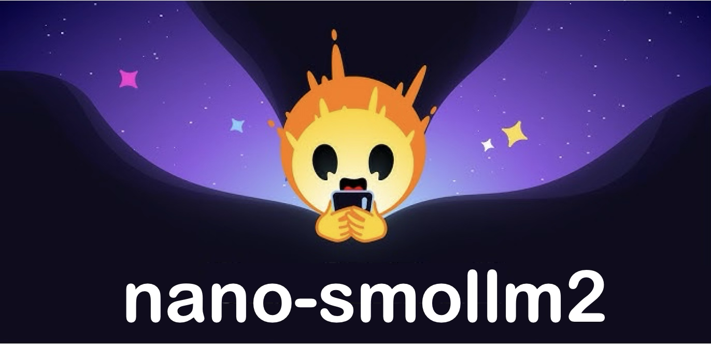
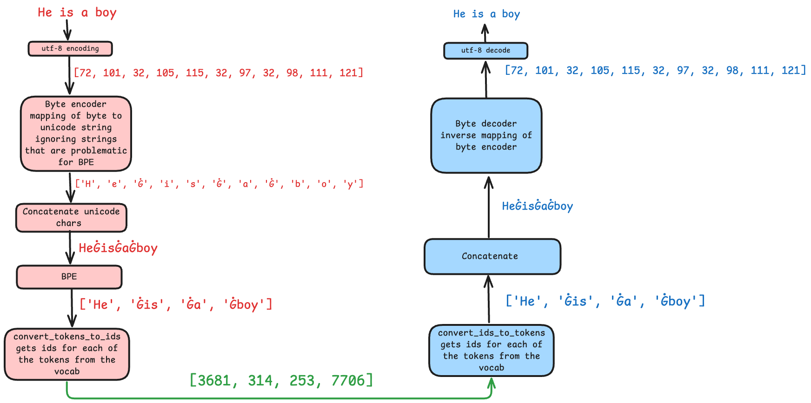

# nano-smollm2



- This repo is a very minimal dependancy-free implementation (120 LOC) of SmolLMv2
- This repo is to SmolLM2 what [nanoGPT](https://github.com/karpathy/nanoGPT.git) is to GPT2
- This code currently focuses on the smallest i.e. 135M version of SmolLM2
- Every module of the model and tokenizer has been compared against the official implementation of SmolLM2

## Who is this for?

Anyone who

- Is interested in the inner workings of a llm and a tokenizer
- Is in search of a dependancy-free implemenation of a decent model with a small memory footprint to try out new ideas

## Quick start

### Download model weights, tokenizer files

```bash
python download.py
```

### Create environment and install deps

```bash
pip install uv
uv venv ml --python 3.9
source ml/bin/activate
uv pip install torch torchvision torchaudio regex safetensors pyarrow pandas huggingface_hub requests
```

### Run inference with the model

```python
import torch
from tokenizer import Tokenizer
from model import SmolLM2

# load model 
device = torch.device("cuda") if torch.cuda.is_available() else torch.device("cpu") 
model = SmolLM2()
model.load_state_dict(torch.load("model.pt"), strict = False)
model = model.to(device)

# load tokenizer
tok = Tokenizer(vocab_file= "vocab.json", merges_file="merges.txt", special_tokens_file="special_tokens.json")

# sample from the model
messages = [{"role": "user", "content": "What is gravity?"}]
model.generate(tok = tok, conversation=messages)
```

## Files

### [download.py](download.py)

This file:

1. Downloads the model weights from the huggingface repo in the safetensors format
2. Coverts the downloaded `model.safetensors` to pytorch weights and save them as `model.pt`
3. Downloads the tokenizer files `merges.txt`, `vocab.json` from the huggingface repo

### [model.py](model.py)

This is the minimal dependancy-free implementation (120 LOC) of SmolLMv2

### [tokenizer.py](tokenizer.py)

- This is a stripped down version of huggingface implementation of [gpt2 tokenizer](https://github.com/huggingface/transformers/blob/main/src/transformers/models/gpt2/tokenization_gpt2.py)
- The huggingface implementation is not the straightforward BPE but there is a byte encoder in addition to the utf-8 encoding. This is done to remove some probelematic strings on which BPE breaks. So as an extra encoder is added there is also an extra decoder in the decoding stage.
- Below is a simple diagram representating what the code in [tokenizer.py](tokenizer.py) does while encoding and decoding for a sentence with no special tokens
  

### [test_implementations.py](test_implementations.py)

- This file contains all the tests which can be used to compare our implementation with the official huggingface implementation
- You will obviously need transformers to run the tests so you have to `pip install -U transformers` before running the tests from this file

- You can run the following tests in a seperate file

```python
from test_implementations import (
    test_decoder,
    test_attention_smollm2,
    test_smollm2,
    test_rms,
    test_mlp,
    test_rope_smollm2
)

test_rope_smollm2() # tests the RoPE implementation
test_decoder() # tests the decoder module of smollm2
test_attention_smollm2() # tests the attention module of smollm2
test_rms() # tests the root mean square module of smollm2
test_mlp() # tests the mlp module of smollm2 
test_smollm2() # tests the entire smollm2 model
test_tokenizer() # tests the tokenizer implementation
```

## References

- [nano-gpt]([link](https://github.com/karpathy/nanoGPT)) is minimal dependancy-free implementation of gpt-2 by [Andrej karpathy](https://github.com/karpathy)
- [nano-llama31](https://github.com/karpathy/nano-llama31/tree/master) is minimial dependancy-free implementation of llama 3.1 by [Andrej karpathy](https://github.com/karpathy)
- [minbpe](link) is a minimal, clean code for the (byte-level) Byte Pair Encoding (BPE) algorithm commonly used in LLM tokenization by [Andrej karpathy](https://github.com/karpathy)
- [llama-32 from scratch](https://github.com/rasbt/LLMs-from-scratch/blob/main/ch05/07_gpt_to_llama/standalone-llama32.ipynb) from [llms-from-scratch](https://github.com/rasbt/LLMs-from-scratch) by [Sebastian Raschka](https://github.com/rasbt). This repo is a gold mine for anyone working with LLMs
- [test_rope.py](https://github.com/Lightning-AI/litgpt/blob/main/tests/test_rope.py) from [litgpt](https://github.com/Lightning-AI/litgpt) was really helpful as they have compared all the major implementations of RoPE
- [tokenizer.py](tokenizer.py) is a stripped down version of [gpt2 tokenizer](https://github.com/huggingface/transformers/blob/main/src/transformers/models/gpt2/tokenization_gpt2.py) from huggingface transformers
- [llama implementation](https://github.com/huggingface/transformers/blob/main/src/transformers/models/llama/modeling_llama.py) from huggingface transformers  

## TODOs

- Implement KV cache for faster inference
- Add minimal training script for fine-tuning
